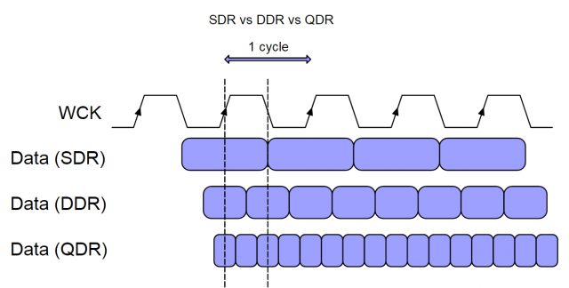
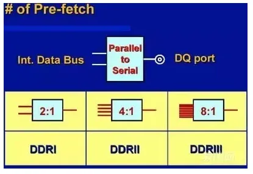
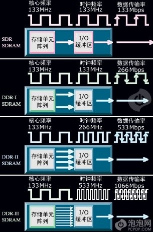
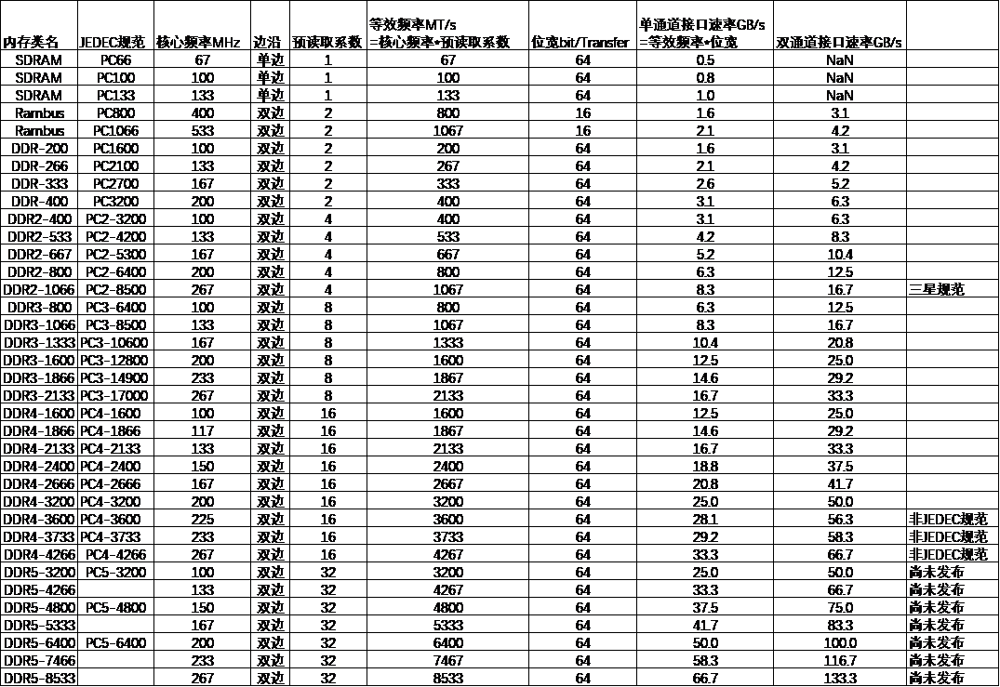
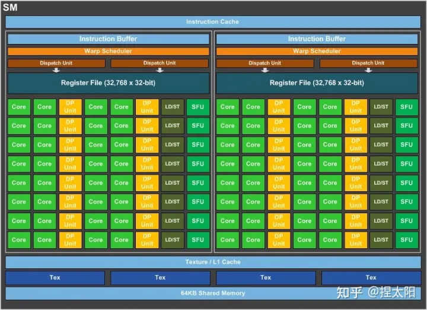
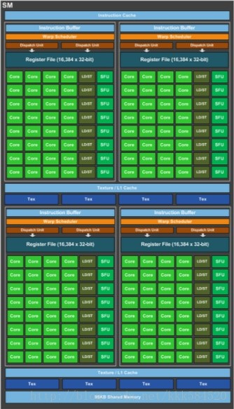
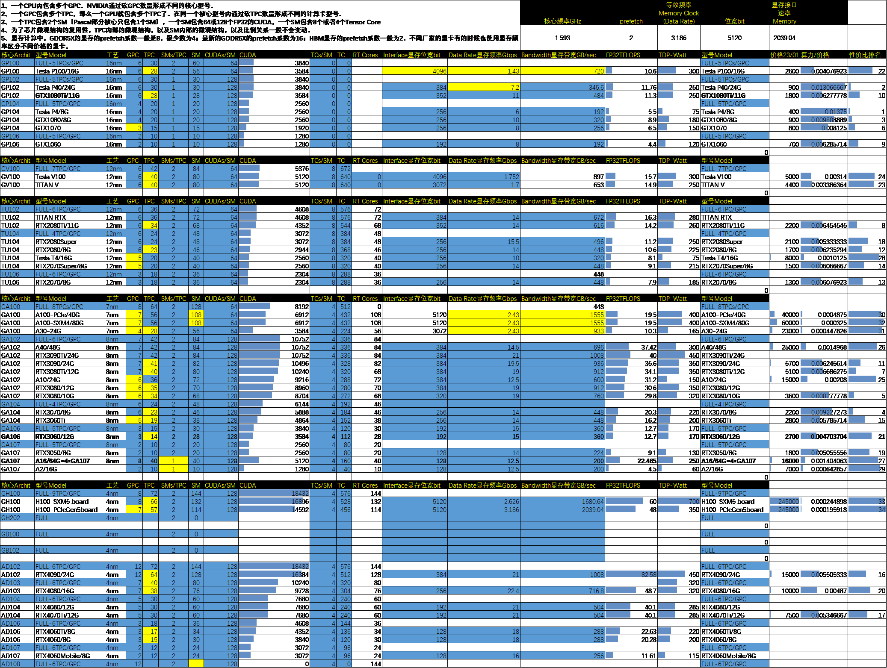

# GPU显存读写和计算性能原理和估计

1.  **DDR内存类型和速率预估**

SDR(单倍数据倍率Single Data Rate)技术，即只利用时钟信号的上沿来传输数据，采用SDR技术的内存成为SDRAM（Single Data Rate SDRAM）。

DDR(双倍数据倍率Double Data Rate)技术，即同时利用了时钟信号的上沿和下沿来传输数据，这意味着系统可以在同样的时间内、同一时钟频率下将传输数据的速率提升一倍；

QDR(四倍数据倍率Quad Data Rate)则在DDR的基础上，进一步提供独立的写入接口和读取接口，以此达到四倍之于SDR的数据传输速率

{width="5.619402887139108in" height="2.844822834645669in"}

核心频率是电路板上晶振倍频后的波形频率，是能通过示波器看到的频率。核心频率目前基本没有突破，都是100MHz到200MHz，一般有100MHz、133MHz、166MHz、200MHz四种，从DDR3开始出现了一些高核心频率的标准，他们工作的核心频率是233MHz和266MHz。

内存的技术演进，主要通过引入Double Data Rate技术以及 Prefetch技术。这两个技术能等效地提高数据传输速率，因此内存厂家将等效的内存工作频率用工作频率表示，工作频率度量的是内存的每秒传输笔数，单位是MT/s或GT/s，其中的T表示Transfer。工作频率有的时候也被称为等效频率或单线时钟频率，我们将工作频率乘以接口位宽再除以8，就可以获得接口上的数据传输速率MB/s或GB/s。

Double Data Rate技术，是在核心频率波形的上升沿和下降沿同时传输数据的技术。使用了Double Data Rate技术后，工作频率就会是核心频率的2倍。例如核心频率是133MHz、166MHz、200MHz的DDR内存的工作频率为266 MHz、333 MHz、400MHz。

Prefetch技术，是在一个内核时钟周期同时寻址多个存储单元并将这些数据以并行的方式统一传输的技术。Prefetch技术虽然是从DDR2之后才提出来的，但是也把Double Data Rate技术运用在了DDR的内存上，因为在核心频率的波形上下沿同时传输数据相当于核心频率翻倍，所以DDR的prefetch系数为2，也称为"2-bit prefetch"。DDR2和DDR3分别是"4-bit prefetch"和"8-bit prefetch"。

{width="3.0in" height="2.067468285214348in"}{width="1.3716601049868766in" height="2.073950131233596in"}

DDR4和DDR5分别是"16-bit prefetch"和"32-bit prefetch"，只是他们是通过Bank Group技术实现的。DDR4的Bank Group技术源于GDDR5的Bank Group（BG），4个Bank作为一个BG，可自由使用2-4组BG，各个BG具备独立启动操作读、写等动作特性，让内存控制器和BG组之间实现交错操作，加上其他技术手段的加入，可以让等效频率可以提升到核心频率的16倍。DDR5则可以让工作频率提升到核心频率的32倍。

有了prefetch技术后，我们就将提出了一个速率放大倍数的概念，预读取系数。预读取系数综合Double Data Rate技术和prefetch技术的速度放大效果，有了预读取系数，我们只要直接将核心频率乘以预读取系数，就可以得到单位为MT/s或GT/s的工作频率（或单线时钟频率，单位为bit/s），再将工作频率乘以位宽（bit）再除以8，就可以得到数据传输速率MB/s或GB/s。

2.  **显存类型和速率评估**

显存的核心频率也称为显存时钟频率，它比内存的核心频率要高，一般1188MHz、1251 MHz、1376MHz、1753MHz、2002MHz、2052MHz。显存的核心频率一般是内存核心频率（100MHz到200MHz之间）的10倍。

GDDR5、GDDR5X和GDDR6的prefetch系数都是8，等于DDR3的8，是DDR4的16和DDR5的32的1/2和1/4。GDDR6X的prefetch系数是16，等于DDR4的prefetch系数，是DDR5的32的1/2。

等效频率是核心频率乘以预读取系数，显存的预读取系数低于内存，这会导致显存的等效频率，仅仅是内存的等效频率的5倍左右。

位宽根据显存芯片的排列决定，一般有128bit、192 bit、256 bit、384 bit。显存的位宽明显较内存的64bit位宽大，是内存位宽的2倍到6倍。

综上，显存的核心频率已经是内存核心频率的10倍，显存的预读取系数是内存的预读取系数的1/2或1/4，显存的位宽也是内存的2到6倍，所以显存的数据传输速率一般是内存传输速率的10到15倍。当单通道内存的数据传输速率还在10-40GB/s徘徊的时候，显存的数据传输速率已经大多突破100GB/s到600GB/s之间。采用了GDDR6X和384bit位宽的极限情况下，显存的数据传输速率甚至可以接近1000GB/s。

显存计算中，GDDR5X的显存的prefetch系数一般是8，极少数为4；最新的GDDR6X的prefetch系数为16；HBM显存的prefetch系数一般为2。不同厂家的显卡有的时候也使用显存频率区分不同价格的显卡。

{width="5.768055555555556in" height="3.9659722222222222in"}

3.  **英伟达GPU架构**

GPU，Graphics Processing Unit，图形处理单元；一般一张显卡只有1个GPU，少数例如A16计算卡有4个GPU。

GPC，Graphics Processing Cluster，图形处理簇；一个GPU内包含多个GPC。NVIDIA通过砍GPC数量形成不同的核心型号。

TPC，Texture Processing Clusters，纹理处理簇；一个GPC包含多个TPC，那么一个GPU就包含多个TPC了。在同一个核心型号内通过砍TPC数量形成不同的计算卡型号。

SM，Streaming Multiprocessor，流多处理器；一个TPC包含2个SM（Pascal部分核心只包含1个SM），一个SM包含64或128个FP32的CUDA，一个SM包含8个或者4个Tensor Core

CUDA，Compute Unified Device Architecture，统一计算架构；每个SM包含的CUDA数量不会变化，例如GP系列每个SM内有64或128个CUDA，TU系列每个SM内有128个CUDA，AD系列每个SM内有128个CUDA。

为了芯片微观结构的复用性，TPC内部的微观结构，以及SM内部的微观结构，以及比例关系一般不会变动。

案例：

GA100：8 GPCs，8 TPCs/GPC，2 SMs/TPC，16 SMs/GPC，8\*8\*2=128 SMs per full GA100

GA102：7 GPCs，8 TPCs/GPC，2 SMs/TPC，16 SMs/GPC，7\*8\*2=108 SMs per full GA102

GP100：6个GPC，每个GPC有5个TPC，每个TPC有2个SM，合计6\*5\*2=60个SM。

TU102：6个GPC，每个GPC有6个TPC，每个TPC有2个SM，合计6\*6\*2=72个SM。

AD102：12个GPC，每个GPC有6 TPC，每个TPC有2个SM，合计12\*6\*2=144个SM。

下图为GP100的SM内包含的CUDA单元为64个；下图右侧为GP104的SM内包含的CUDA单元为128个

{width="3.625in" height="2.628125546806649in"}{width="1.5104166666666667in" height="2.635824584426947in"}

4.  **英伟达GPU性价比-截至2023-1-1**

{width="5.768055555555556in" height="4.345833333333333in"}
