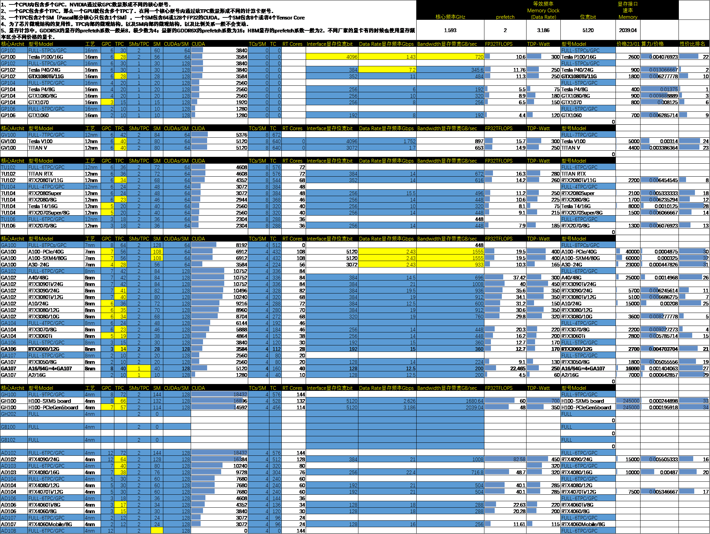

# GPU_Hunter

In this repo, I recall all the memory types and its performance, so you can figure out how your type of ddr/gddr ram succeed others.
Also, I read almost all NVIDIA white papers, and make a collection of its GPU architecture, and find a relationship among GPU/GPC/TPC/SM/CUDA, so you can figure out which GPU is the best deal.

Hope it helps!
{width="5.768055555555556in" height="4.345833333333333in"}
